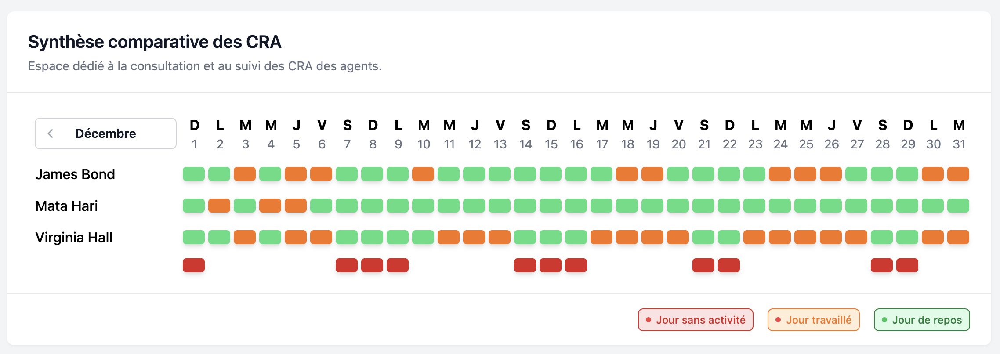

# Opération CRA - Application de Gestion des Comptes Rendus d'Activité

Bienvenue dans l'application **Opération CRA**, une solution Angular pour gérer les plannings de mission de trois agents spéciaux.


## Prérequis

Avant de commencer, assurez-vous que votre environnement dispose des éléments suivants :

- **Node.js** à partir de la version 16 ou supérieure.
- **npm** (généralement inclus avec Node.js).
- **Angular CLI** :
  ```bash
  npm install -g @angular/cli
  ```

## Installation

Clonez le dépôt GitHub et installez les dépendances du projet :

```bash
git clone https://github.com/jiu-dev/operation-cra.git
cd operation-cra
npm install
```

## Démarrage de l'application

Pour lancer l'application en mode développement :

```bash
npm run start
```

L'application sera accessible à l'adresse suivante : [http://localhost:4200](http://localhost:4200).

## Exécution des tests unitaires

Des tests unitaires sont fournis pour garantir la fiabilité de l'application. Pour les exécuter :

```bash
npm run test
```

Les résultats des tests seront affichés dans la console.

## Structure du projet

Voici un aperçu de l'architecture du projet :

```
operation-cra/
├── app/
│   ├── core/               # Enums, services et interfaces de base
│   ├── features/           # Modules et composants des fonctionnalités principales
│   ├── shared/             # Composants et pipes partagés
│   ├── state/              # Gestion de l'état avec Signal Store
│   ├── app.module.ts       # Module racine
├── assets/                 # Données statiques et mocks
├── main.ts                 # Point d'entrée de l'application
├── styles.scss             # Styles globaux / Setup de TailwindCss
└── angular.json            # Configuration Angular
```

## Fonctionnalités principales

- **Visualisation des plannings** : Affichage des missions et des semaines de repos sur une période de trois mois avec des vues mensuelles.
- **Modification intuitive** : Interface utilisateur intuitive pour imputer les efforts des agents sur chaque mission.
- **Signal Store** : Gestion de l'état centralisée avec une architecture performante et maintenable.
- **Tests robustes** : Tests unitaires couvrant les éléments critiques de l'application.

## Déploiement

Pour préparer l'application pour un environnement de production :

```bash
npm run build:prod
```

Les fichiers optimisés seront générés dans le répertoire `dist/operation-cra`.
